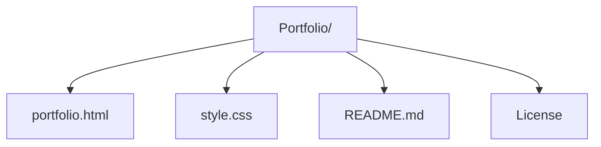

<div align="center">
  
  # ✦ PORTFOLIO ✦
  
  ### *Where Code Meets Identity*
  
  [](https://github.com/PhantomXReborn)
  [](https://beta-bite-website-4iwcyg76n-phantomxreborns-projects.vercel.app/)
  [](LICENSE)
  [](https://github.com/PhantomXReborn)
  
  > *"Collecting Experience through Ideas and Creativity."*

</div>

---

## 🌠 **The Vision**

Welcome to my portfolio! A digital storage system where projects are set free, and innovation knows no bounds. This isn't just a website; it's an immersive journey through the creative cosmos, featuring:

<div align="center">
  
  | 🎮 **Projects** | ⚙️ **Coding Languages** |
  |:---:|:---:|
  | Yatzy • Resume • Emergency Waitlist | HTML5 • CSS • JavaScript |

</div>

---

## ✨ **Features**

<div align="center">
  
  | 🌌 **Galactic Canvas** | 🎠 **Project Carousel** | 📡 **Live GitHub Feed** |
  |:---:|:---:|:---:|
  | Animated particles, stars & code glyphs | Interactive slider with tech overlays | Real-time repository showcase |
  
  | 🔮 **Theme Shapeshifter** | 📊 **Scroll Alchemy** | ✨ **Responsive Magic** |
  |:---:|:---:|:---:|
  | Dark/Light mode with ⌨️ 't' shortcut | Animated counters & progress bar | Seamless across all dimensions |

</div>

## 🛸 **Tech**

<div align="center">
  
  ### Frontend
  
  
  
  
  ### Visuals
  
    
</div>

---

## 🗂️ **Cosmic Structure**



✨ Particle Theme
```javascript
  const particles = document.querySelectorAll('.particle');
  particles.forEach((p, i) => {
    p.style.left = (i * 10 + Math.random() * 5) + '%';
    p.style.animationDelay = (Math.random() * 8) + 's';
    p.style.animationDuration = (18 + Math.random() * 10) + 's';
  });
});
```
🎯 Smooth Scrolling
```javascript
filterButtons.forEach(btn => {
  btn.addEventListener('click', function() {
    filterButtons.forEach(b => b.classList.remove('active'));
    this.classList.add('active');

    const filterValue = this.getAttribute('data-filter');
      filterProjects(filterValue);
  });
});
}, { threshold: 0.5 });
```

 Filter Button Effect
```javascript
      document.querySelectorAll('a[href^="#"]').forEach(anchor => {
        anchor.addEventListener('click', function(e) {
          const href = this.getAttribute('href');
          if (href === '#') return; // skip empty links

          const target = document.querySelector(href);
          if (target) {
            e.preventDefault();
            target.scrollIntoView({
              behavior: 'smooth',
              block: 'start'
            });
          }
        });
      });
}, { threshold: 0.5 });
```

📜 License
<div>
This project is blessed under the MIT License — a sacred text that allows you to forge, enhance, and share your own cosmic creations. See the LICENSE file for the full incantation.
</div>

🌌 Fork the repository

✨ Create a feature branch (git checkout -b feature/cosmic-idea)

🚀 Commit your changes (git commit -m 'Add cosmic idea')

🌠 Push to the branch (git push origin feature/cosmic-idea)

🌟 Open a Pull Request to the universe

📡 Creator
<div align="center"> <br>
✦ Made By Reece Hannah ✦

<sub>2026 Reece Hannah • MIT License Used</sub>

</div>
